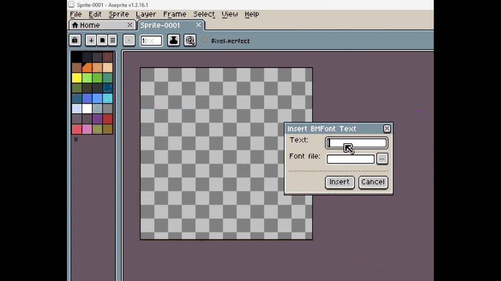

# BMFont Text Aseprite

Use bitmap fonts directly in Aseprite!

Download from [itch.io](https://voycawojka.itch.io/bmfont-text-aseprite).

## How to use?

1. Download and install the extension
    - [itch.io download](https://voycawojka.itch.io/bmfont-text-aseprite)
    - double click the file to install
3. Edit -> Insert -> Insert BMFont Text
5. Type your text
    - tip: type `\n` to insert a new line
4. Pick a `.fnt` file
    - the matching PNGs are loaded automatically
5. Insert the text

## Where to get bitmap fonts?

I made the plugin primarily for fonts made with [Calligro](https://calligro.ideasalmanac.com/).
This way you can easily draw your own fonts any way you like.
(when exporting from Calligro choose the TXT option)

Having said that, the plugin should also work with BMFonts created with other software, like:
- [AngelCode's BMFont](https://www.angelcode.com/products/bmfont/) 
- [Hiero](https://libgdx.com/wiki/tools/hiero)
- [ShoeBox](http://renderhjs.net/shoebox/)
Those programs are meant for converting regular TTF fonts into bitmap fonts though. 
You may just want to use the TTF fonts directly in those cases.

## Limitations

Because of the limitations of Aseprite plugins, inserting text will override whatever you have in your clipboard.
Keep that in mind!
